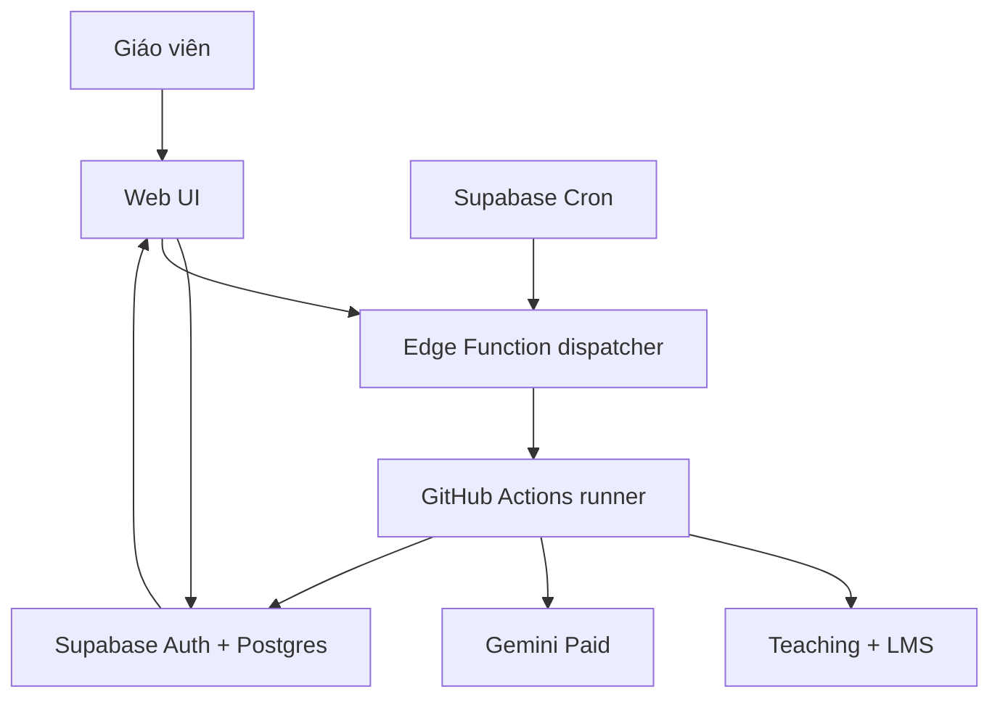

# Kế hoạch V4 — Bot lịch dạy và tạo nhận xét MindX

> Kiến trúc: `browser-use/browser-use` + Supabase Auth/Postgres + GitHub Actions + Gemini + quy trình Superpowers  
> Trạng thái tài liệu: đặc tả triển khai dành cho Codex/AI coding  
> Phiên bản: V4  
> Ngày chốt: 10/08/2026  
> Múi giờ nghiệp vụ: `Asia/Ho_Chi_Minh`

---

## 0. Cách sử dụng tài liệu

Tài liệu này là nguồn sự thật chính cho MVP. Codex phải triển khai theo từng phase, viết test trước theo Superpowers, tạo minh chứng và dừng tại mỗi cổng nghiệm thu.

Nếu tài liệu này mâu thuẫn với code cũ, thứ tự ưu tiên là:

1. An toàn dữ liệu và không ghi nhầm LMS.
2. Các quyết định nghiệp vụ đã chốt trong V4.
3. Migration/database invariant.
4. Test và acceptance criteria.
5. Kiến trúc đề xuất.
6. Chi tiết triển khai có thể thay đổi theo phiên bản thư viện đã pin.

Quy tắc dành cho Codex:

- [ ] Không tự mở rộng thành SaaS đa tenant.
- [ ] Không thêm Kubernetes, microservice, queue thương mại hoặc observability phức tạp.
- [ ] Không tự động gửi Zalo.
- [ ] MVP 1 không tự động bấm Save nhận xét trên LMS.
- [ ] Không tìm cách vượt CAPTCHA, OTP, anti-bot hoặc chính sách website.
- [ ] Không ghi credential, cookie, tên học viên, ghi chú thật vào log/test/evidence.
- [ ] Không đánh dấu phase hoàn thành nếu thiếu minh chứng.
- [ ] Khi selector/danh tính không chắc chắn, dừng và chuyển manual fallback.
- [ ] Khi tài liệu thư viện khác với mã ví dụ, ưu tiên API của phiên bản đã pin và cập nhật ADR.

---

## 1. Mục tiêu, đối tượng và giới hạn

### 1.1. Mục tiêu

Xây một ứng dụng web cá nhân/nhóm nhỏ có thể:

1. Chạy hoàn toàn trên cloud khi máy giáo viên tắt.
2. Đăng nhập `teachingmindx.top` bằng tài khoản hợp lệ để lấy lịch dạy.
3. Đăng nhập LMS MindX bằng tài khoản hợp lệ để đọc thông tin lớp/buổi/học viên.
4. Cho giáo viên chọn mức đánh giá và ghi chú nhanh sau buổi học.
5. Dùng Gemini tạo:
   - một nhận xét LMS 100–200 từ cho mỗi học viên đủ điều kiện;
   - đúng một thông báo Zalo chung cho mỗi lớp/buổi theo template cố định.
6. Cho giáo viên sửa và duyệt nội dung.
7. Xuất CSV/Markdown để giáo viên copy thủ công trong MVP 1.
8. Đo thời gian tiết kiệm và độ tin cậy trước khi cân nhắc live write LMS.

### 1.2. Phạm vi vận hành

- Dự án phục vụ học tập, nghiên cứu và nhu cầu cá nhân/nhóm nhỏ.
- Dự kiến 1–5 người dùng được mời.
- Dự kiến tối đa khoảng 5 lớp/ngày, khoảng 50 học viên/ngày.
- Chỉ dùng tài khoản mà người dùng được phép sử dụng.
- Không cung cấp dịch vụ thương mại cho bên ngoài.
- Không cần SLA production hoặc trực 24/7.
- Vẫn phải bảo vệ dữ liệu thật bằng Auth, RLS, secrets, encryption và audit tối thiểu.

### 1.3. Ngoài phạm vi MVP 1

- Tự động gửi tin nhắn vào nhóm Zalo.
- Tự động Save nhận xét lên LMS.
- Thu thập sản phẩm học viên hoặc file cá nhân nếu không thật sự cần.
- Tự động xử lý CAPTCHA/OTP.
- Mobile app native.
- Hệ thống quản lý template động.
- Billing, subscription, tổ chức đa tenant.
- Phân quyền enterprise.
- Kho dữ liệu lịch sử lâu dài hoặc data warehouse.

### 1.4. Tiêu chí thành công sản phẩm

| Chỉ số | Mục tiêu MVP | Cách đo |
|---|---:|---|
| Chọn đúng lớp/buổi | 100% trong tập thử | đối chiếu thủ công |
| Gắn đúng học viên | 100%, không suy đoán | ID/discriminator + exact check |
| Nhận xét LMS hợp lệ | ≥ 95% sau tối đa 1 lần repair | validator |
| Nhận xét cần sửa nhiều | < 30% | giáo viên đánh dấu |
| Dữ liệu cấm trong prompt/log | 0 | privacy tests |
| Tác vụ cloud thành công | ≥ 95% trong tuần thử | `automation_runs` |
| Thời gian giáo viên tiết kiệm | ≥ 30% | before/after timer |
| Ghi nhầm LMS | 0 | MVP không có write action |

---

## 2. Các quyết định nghiệp vụ đã chốt

- [x] Bot phải chạy khi máy giáo viên tắt.
- [x] Người dùng đăng nhập ứng dụng bằng Supabase Auth email/password.
- [x] Không cho đăng ký công khai.
- [x] Giáo viên nhập nhanh mức đánh giá và ghi chú trên web.
- [x] Attendance bắt đầu là `unknown` và phải được xác nhận.
- [x] Học viên vắng không được sinh nhận xét LMS nếu quy tắc nghiệp vụ không cho phép.
- [x] Nhận xét LMS gồm ba phần deterministic: điểm mạnh, điểm cần cải thiện, hướng rèn luyện.
- [x] Nhận xét LMS sau khi render dài 100–200 từ.
- [x] Zalo là một nội dung chung cho mỗi lớp/buổi, không có Zalo theo học viên.
- [x] Zalo dùng template cố định; AI chỉ sinh các trường biến đổi.
- [x] Bài hiện tại và bài tiếp theo lấy từ curriculum lưu sẵn, không để AI tự bịa.
- [x] Giáo viên duyệt trước khi copy/export.
- [x] MVP 1 chỉ đọc Teaching/LMS, không live write.
- [x] Tên trùng không được map theo row order.
- [x] Nếu không có discriminator ổn định, trạng thái là `unresolvable`.

### 2.1. Mã khóa học ban đầu

| Mã | Khóa học |
|---|---|
| SB | Scratch Basic |
| SA | Scratch Advanced |
| SI | Scratch Intensive |
| PTB | App Producer Basic |
| PTA | App Producer Advanced |
| PTI | App Producer Intensive |
| JSB | Web Developer Basic |
| ROB | Robotics |
| GA/GB | Game Creator theo catalog thực tế |

Mã trên chỉ là seed. Codex phải đọc catalog do chủ dự án cung cấp và không suy diễn từ chuỗi lớp khi chưa có mapping.

### 2.2. Dữ liệu chủ dự án cần cung cấp

- [ ] Danh sách mã lớp hiện hành.
- [ ] Tên giáo viên và cách xưng hô dùng trong Zalo.
- [ ] Course catalog chính xác.
- [ ] Curriculum từng khóa: số buổi, tiêu đề, nội dung, lưu ý, bài tập.
- [ ] Template Zalo cuối cùng.
- [ ] Quy tắc học viên vắng/có phép/online.
- [ ] Hai bộ credential thật được nhập trực tiếp vào GitHub Secrets/Supabase Secrets, không gửi vào chat/code.
- [ ] API key Gemini Paid thuộc Cloud Project đã bật billing.

---

## 3. Vai trò của ba công nghệ mới

### 3.1. `browser-use/browser-use`

Được dùng trong Python cloud runner để điều khiển Chromium và hỗ trợ điều hướng khi website thay đổi nhẹ.

Được phép:

- đăng nhập bằng credential từ secret;
- mở trang lịch;
- áp dụng bộ lọc đã xác định;
- điều hướng đến đúng lớp/buổi;
- khôi phục từ thay đổi giao diện nhỏ trong phạm vi domain allowlist;
- trả structured output bằng Pydantic.

Không được phép:

- tự do click mọi nút;
- truy cập domain ngoài allowlist;
- bấm Save nhận xét LMS trong MVP 1;
- gửi nội dung LMS chứa tên học viên cho LLM điều hướng nếu có thể tránh;
- quyết định danh tính lớp, buổi hoặc học viên chỉ bằng suy luận LLM;
- giải CAPTCHA hoặc vượt anti-bot.

Quy tắc kiến trúc: Browser Use Agent hỗ trợ navigation; parser deterministic chịu trách nhiệm extraction và identity boundary.

### 3.2. Supabase

Supabase chịu trách nhiệm:

- Auth email/password;
- Postgres database;
- Row Level Security;
- private Storage cho `storageState` đã mã hóa nếu cần;
- Edge Functions ngắn hạn;
- Cron để tạo/dispatch job;
- Realtime hoặc polling trạng thái job.

Supabase Edge Functions không chạy Chromium. Browser Use là Python + browser dài hơn và chạy trong GitHub Actions.

### 3.3. Superpowers

Superpowers là giao thức phát triển trong Codex, không phải runtime package.

Mỗi phase phải áp dụng:

1. `brainstorming` trước thay đổi thiết kế.
2. `writing-plans` để chia task nhỏ.
3. `using-git-worktrees` cho nhánh cô lập.
4. `test-driven-development`: RED → GREEN → REFACTOR.
5. `systematic-debugging` khi test lỗi.
6. `requesting-code-review` trước merge.
7. `verification-before-completion` trước tuyên bố hoàn thành.
8. `finishing-a-development-branch` để bàn giao nhánh sạch.

Không được dùng Superpowers như lý do tạo quá nhiều agent hoặc mở rộng phạm vi. Với dự án nhỏ, một task nên hoàn thành trong 15–60 phút và một phase nên tạo một PR/nhánh dễ review.

---

## 4. Kiến trúc V4 đề xuất

### 4.1. Stack chính

| Thành phần | Công nghệ | Lý do |
|---|---|---|
| Web UI | React + Vite + TypeScript | nhỏ, nhanh, static |
| Hosting UI | Vercel Hobby hoặc Cloudflare Pages | free-first, thay thế được |
| Auth | Supabase Auth | email/password, session chuẩn |
| Database | Supabase Postgres | RLS, SQL, migration rõ |
| Scheduler | Supabase Cron | lịch trung tâm |
| Dispatcher | Supabase Edge Function | xác thực, enqueue, gọi runner |
| Browser runner | GitHub Actions Ubuntu | cloud khi PC tắt, không server luôn bật |
| Browser automation | Python 3.12 + browser-use + Chromium | theo yêu cầu repo |
| Parser nhạy cảm | deterministic DOM locator/parser | không giao identity cho LLM |
| AI nội dung | Gemini Paid | structured generation |
| Validation | Pydantic + Zod | fail-closed hai phía |
| Test web | Vitest + Testing Library + Playwright | unit/component/E2E |
| Test runner | pytest + pytest-asyncio | Python automation |
| Lint/type | ESLint, TypeScript, Ruff, mypy | feedback nhanh |
| Development | Codex + Superpowers | TDD/review/evidence |

### 4.2. Sơ đồ luồng cloud



### 4.3. Luồng job

1. Cron hoặc owner bấm “Đồng bộ”.
2. Edge Function xác minh caller.
3. Edge Function tạo `automation_jobs` bằng idempotency key.
4. Edge chuyển `queued → dispatching → dispatched` chỉ sau khi GitHub chấp nhận request; retry từ `dispatch_failed` phải đi lại qua bước dispatch.
5. Edge Function gọi GitHub `workflow_dispatch` với `job_id` duy nhất.
6. GitHub Action claim job atomically.
7. Runner tải/decrypt browser state hoặc đăng nhập mới.
8. Runner thực hiện task read-only.
9. Runner validate output và ghi normalized data qua RPC/backend API.
10. Runner đóng browser trong `finally`.
11. Runner cập nhật trạng thái, duration, error code và browser metrics.
12. Dashboard polling/realtime hiển thị kết quả.

### 4.4. Tại sao không chạy Browser Use trong Edge Function

- Edge Function là Deno/TypeScript, trong khi Browser Use OSS là Python.
- Chromium nặng và job có thể dài hơn request thông thường.
- Browser session cần filesystem tạm, dependency và timeout riêng.
- Tách runner giúp retry, log, pin dependency và failure isolation rõ hơn.

### 4.5. Ước tính free-first

| Dịch vụ | Mức dự kiến | Ghi chú |
|---|---:|---|
| Browser Use OSS | 0 USD | tự host runner |
| Supabase Free | 0 USD | đủ cho nhóm nhỏ; theo dõi thay đổi quota |
| GitHub Actions | trong quota tài khoản | đo số phút thực tế sau Spike |
| Frontend static | 0 USD | theo giới hạn nhà cung cấp |
| Gemini | có chi phí nhỏ | bắt buộc Paid theo quyết định privacy |

Không coi quota là hằng số. Ghi ngày kiểm tra quota trong ADR và thêm cost guard.

---

## 5. Ranh giới tin cậy và privacy

### 5.1. Phân vùng dữ liệu

| Vùng | Có thể chứa tên học viên | Có thể chứa credential | Ghi chú |
|---|---:|---:|---|
| Browser memory | Có | Có, ngắn hạn | runner ephemeral |
| Supabase Postgres | Có | Không | dữ liệu nghiệp vụ + RLS |
| Supabase Storage | Không ở tên object | encrypted state | private + AES-GCM |
| Gemini generation | Không | Không | alias ngẫu nhiên + redaction |
| Browser Use navigation LLM | Không theo thiết kế | Không trong prompt | tránh trang roster nhạy cảm |
| GitHub log/artifact | Không | Không | safe logger |
| Export tải về | Có | Không | do user yêu cầu, không lưu công khai |
| Evidence repository | Chỉ synthetic | Không | bắt buộc |

### 5.2. Rủi ro riêng của Browser Use

Browser Use Agent quan sát page state để gửi cho model. Nếu Agent hoạt động trên trang roster, DOM hoặc screenshot có thể chứa dữ liệu học viên.

Biện pháp bắt buộc:

- [ ] Spike xác minh payload/telemetry của phiên bản Browser Use đã pin.
- [ ] Không truyền tên học viên hoặc ghi chú thật vào task prompt.
- [ ] `use_vision=false` ở flow nhạy cảm nếu DOM đủ dùng.
- [ ] Không lưu screenshot/video/trace thật mặc định.
- [ ] Dừng Agent trước bảng roster và chuyển sang deterministic parser.
- [ ] Nếu không thể chứng minh PII không rời runner, dùng hybrid: Browser Use điều hướng đến lớp, Playwright/CDP deterministic đọc trang nhạy cảm.
- [ ] Nếu hybrid vẫn không kiểm soát được, NO-GO Browser Use cho LMS và giữ Playwright-only LMS reader.
- [ ] Không dùng Browser Use Cloud cho dữ liệu học viên trong MVP nếu chưa thẩm định điều khoản và data flow.

### 5.3. Credential và session

- Credential Teaching/LMS chỉ ở GitHub Encrypted Secrets.
- Supabase backend secret chỉ ở GitHub Secrets/Edge Secrets.
- Frontend chỉ dùng publishable key.
- Không dùng legacy `service_role` nếu dự án mới hỗ trợ secret key mới; nếu SDK bắt buộc, ghi ADR và kế hoạch đổi.
- Browser state được mã hóa AES-256-GCM trước khi upload.
- Mỗi object có `key_version`, `iv`, `tag`, `ciphertext`.
- Key mã hóa không nằm trong Supabase Storage/Postgres.
- Object path không chứa username/email.
- Reset state phải xóa version hiện tại và buộc login mới.

### 5.4. Redaction

Trước Gemini:

1. Thay học viên bằng alias ngẫu nhiên theo từng generation, ví dụ `A7K2Q`.
2. Loại tên phụ huynh, số điện thoại, email, địa chỉ, bệnh lý và thông tin nhạy cảm.
3. Chỉ gửi mức đánh giá, hành vi học tập liên quan và evidence ID.
4. Không gửi class code nếu không cần.
5. Ghi payload hash và danh sách field, không ghi payload thô vào log.

Định nghĩa “PII leak = 0” trong dự án:

> Không có credential hoặc dữ liệu bị cấm trong Gemini payload, Browser Use LLM payload, log, telemetry và evidence. Tên trong dashboard, Postgres và export được phép vì là dữ liệu nghiệp vụ có Auth/RLS.

---

## 6. Supabase Auth và phân quyền tối giản

### 6.1. Chính sách tài khoản

- Email/password.
- Tắt public sign-up.
- MVP tạo 1–5 user qua Supabase Dashboard.
- Không xây invite UI ở MVP.
- Bắt buộc mật khẩu mạnh theo cấu hình Auth.
- Có thể bật email confirmation khi custom SMTP sẵn sàng.
- Không phụ thuộc SMTP mặc định cho luồng vận hành hàng ngày.
- Owner có thể vô hiệu hóa user trong Dashboard.

### 6.2. Role

| Role | Quyền |
|---|---|
| `owner` | cấu hình, trigger automation, reset session, xóa dữ liệu, quản lý catalog |
| `reviewer` | xem session, nhập notes, generate, sửa, approve, export, confirm delivery |

Không thêm role khác trong MVP.

### 6.3. Auth checklist

- [ ] Tạo Supabase project tại region phù hợp.
- [ ] Ghi project ref vào `.env.example`, không ghi secret.
- [ ] Tắt “Allow new users to sign up”.
- [ ] Tạo owner bằng Dashboard.
- [ ] Tạo reviewer thử nghiệm.
- [ ] Tạo `workspaces` và `workspace_members`.
- [ ] Mọi route web riêng tư kiểm tra session.
- [ ] Mọi mutation dùng access token hợp lệ.
- [ ] Edge Function manual trigger xác minh JWT và role owner.
- [ ] Cron trigger dùng secret riêng, không giả làm user.
- [ ] Logout xóa local app state.
- [ ] Test token hết hạn và refresh.
- [ ] Test user bị disable.

---

## 7. Database Postgres

### 7.1. Nguyên tắc

- UUID nội bộ immutable.
- Mọi bảng nghiệp vụ có `workspace_id`.
- Timestamp dùng `timestamptz` UTC; convert ở UI.
- `scheduled_start_at`/`scheduled_end_at` là UTC dùng để query; `scheduled_date`/`start_time`/`end_time` là local normalized dùng đối chiếu nguồn và hiển thị.
- Không dùng ngày/giờ làm identity tuyệt đối của session.
- Dùng partial unique index cho nullable source IDs và review types.
- JSON chỉ dùng cho snapshot/evidence linh hoạt; field query thường xuyên phải có cột riêng.
- RLS bật trước khi đưa dữ liệu thật vào.

### 7.2. Bảng lõi

```sql
create extension if not exists pgcrypto;

create table public.workspaces (
  id uuid primary key default gen_random_uuid(),
  name text not null,
  timezone text not null default 'Asia/Ho_Chi_Minh',
  created_at timestamptz not null default now()
);

create table public.workspace_members (
  workspace_id uuid not null references public.workspaces(id) on delete cascade,
  user_id uuid not null references auth.users(id) on delete cascade,
  role text not null check (role in ('owner', 'reviewer')),
  created_at timestamptz not null default now(),
  primary key (workspace_id, user_id)
);

create table public.teacher_profiles (
  id uuid primary key default gen_random_uuid(),
  workspace_id uuid not null references public.workspaces(id) on delete cascade,
  display_name text not null,
  salutation text not null,
  is_active boolean not null default true,
  created_at timestamptz not null default now(),
  updated_at timestamptz not null default now()
);

create table public.classes (
  id uuid primary key default gen_random_uuid(),
  workspace_id uuid not null references public.workspaces(id) on delete cascade,
  class_code text not null,
  course_code text not null,
  course_name text not null,
  lms_class_id text,
  status text not null default 'active'
    check (status in ('active', 'finished', 'archived')),
  created_at timestamptz not null default now(),
  updated_at timestamptz not null default now(),
  unique (workspace_id, class_code)
);

create table public.teaching_sessions (
  id uuid primary key default gen_random_uuid(),
  workspace_id uuid not null references public.workspaces(id) on delete cascade,
  class_id uuid not null references public.classes(id) on delete cascade,
  source_system text not null default 'teachingmindx',
  source_session_id text,
  session_number integer,
  session_type text,
  scheduled_date date not null,
  start_time time not null,
  end_time time not null,
  scheduled_start_at timestamptz not null,
  scheduled_end_at timestamptz not null,
  schedule_status text not null default 'scheduled'
    check (schedule_status in ('scheduled','rescheduled','cancelled','completed')),
  workflow_status text not null default 'context_pending'
    check (workflow_status in (
      'context_pending','context_ready','generation_pending','generation_failed',
      'awaiting_approval','approved','manually_completed','archived'
    )),
  lesson_number integer,
  source_hash text,
  source_snapshot_json jsonb,
  zalo_delivery_status text not null default 'pending'
    check (zalo_delivery_status in ('pending','copied','confirmed')),
  lms_delivery_status text not null default 'pending'
    check (lms_delivery_status in ('pending','exported','confirmed')),
  zalo_confirmed_at timestamptz,
  lms_confirmed_at timestamptz,
  created_at timestamptz not null default now(),
  updated_at timestamptz not null default now(),
  check (scheduled_end_at > scheduled_start_at)
);

create unique index uq_source_session
on public.teaching_sessions(workspace_id, source_system, source_session_id)
where source_session_id is not null;

create table public.students (
  id uuid primary key default gen_random_uuid(),
  workspace_id uuid not null references public.workspaces(id) on delete cascade,
  class_id uuid not null references public.classes(id) on delete cascade,
  full_name text not null,
  normalized_name text not null,
  lms_student_id text,
  stable_discriminator text,
  mapping_status text not null default 'unmapped'
    check (mapping_status in ('unmapped','mapped','manual','unresolvable')),
  created_at timestamptz not null default now(),
  updated_at timestamptz not null default now()
);

create unique index uq_lms_student
on public.students(class_id, lms_student_id)
where lms_student_id is not null;

create table public.lesson_contexts (
  id uuid primary key default gen_random_uuid(),
  workspace_id uuid not null references public.workspaces(id) on delete cascade,
  session_id uuid not null references public.teaching_sessions(id) on delete cascade,
  lesson_content text not null,
  important_points text[] not null default '{}',
  homework text,
  homework_deadline timestamptz,
  next_lesson_title text,
  next_lesson_content text[],
  general_summary text,
  encouragement text,
  project_progress text,
  context_revision integer not null default 1,
  created_at timestamptz not null default now(),
  updated_at timestamptz not null default now(),
  unique (session_id)
);

create table public.student_session_notes (
  id uuid primary key default gen_random_uuid(),
  workspace_id uuid not null references public.workspaces(id) on delete cascade,
  session_id uuid not null references public.teaching_sessions(id) on delete cascade,
  student_id uuid not null references public.students(id) on delete cascade,
  attendance text not null default 'unknown'
    check (attendance in ('unknown','present','online','absent_excused','absent')),
  performance_level text
    check (performance_level is null or performance_level in ('excellent','good','needs_support')),
  quick_note text,
  highlighted boolean not null default false,
  generation_status text not null default 'pending'
    check (generation_status in ('pending','generated','failed')),
  generation_error_code text,
  note_revision integer not null default 1,
  created_at timestamptz not null default now(),
  updated_at timestamptz not null default now(),
  unique (session_id, student_id)
);

create table public.generated_reviews (
  id uuid primary key default gen_random_uuid(),
  workspace_id uuid not null references public.workspaces(id) on delete cascade,
  session_id uuid not null references public.teaching_sessions(id) on delete cascade,
  student_id uuid references public.students(id) on delete cascade,
  type text not null check (type in ('lms_student','zalo_class')),
  content text not null,
  structured_parts jsonb,
  evidence_ids text[] not null default '{}',
  warnings text[] not null default '{}',
  generation_revision integer not null default 1,
  content_hash text not null,
  status text not null default 'draft'
    check (status in ('draft','approved','rejected')),
  approved_by uuid references auth.users(id),
  approved_at timestamptz,
  template_version integer,
  model_name text,
  created_at timestamptz not null default now(),
  updated_at timestamptz not null default now(),
  check (
    (type = 'lms_student' and student_id is not null)
    or (type = 'zalo_class' and student_id is null)
  )
);

create unique index uq_lms_student_review
on public.generated_reviews(session_id, student_id)
where type = 'lms_student';

create unique index uq_zalo_class_review
on public.generated_reviews(session_id)
where type = 'zalo_class';

create table public.review_approval_events (
  id uuid primary key default gen_random_uuid(),
  workspace_id uuid not null references public.workspaces(id) on delete cascade,
  review_id uuid not null references public.generated_reviews(id) on delete cascade,
  session_id uuid not null references public.teaching_sessions(id) on delete cascade,
  student_id uuid references public.students(id) on delete cascade,
  generation_revision integer not null,
  content_hash text not null,
  approved_by uuid not null references auth.users(id),
  approved_at timestamptz not null default now(),
  nonce uuid not null default gen_random_uuid(),
  unique (review_id, generation_revision, content_hash),
  unique (nonce)
);

create table public.automation_jobs (
  id uuid primary key default gen_random_uuid(),
  workspace_id uuid not null references public.workspaces(id) on delete cascade,
  type text not null check (type in (
    'sync_teaching','read_lms_pending','generate_reviews','cleanup'
  )),
  status text not null default 'queued' check (status in (
    'queued','dispatching','dispatched','running','succeeded','partial',
    'dispatch_failed','failed','cancelled'
  )),
  idempotency_key text not null,
  requested_by uuid references auth.users(id),
  payload_json jsonb not null default '{}',
  attempt_count integer not null default 0,
  max_attempts integer not null default 3,
  runner_id text,
  lease_expires_at timestamptz,
  heartbeat_at timestamptz,
  last_error_code text,
  created_at timestamptz not null default now(),
  started_at timestamptz,
  finished_at timestamptz,
  unique (workspace_id, idempotency_key)
);

create table public.automation_runs (
  id uuid primary key default gen_random_uuid(),
  workspace_id uuid not null references public.workspaces(id) on delete cascade,
  job_id uuid not null references public.automation_jobs(id) on delete cascade,
  attempt integer not null,
  status text not null,
  browser_ms bigint not null default 0,
  duration_ms bigint not null default 0,
  records_read integer not null default 0,
  records_written integer not null default 0,
  error_code text,
  safe_error_detail text,
  started_at timestamptz not null default now(),
  finished_at timestamptz,
  unique (job_id, attempt)
);

create table public.browser_state_versions (
  id uuid primary key default gen_random_uuid(),
  workspace_id uuid not null references public.workspaces(id) on delete cascade,
  site text not null check (site in ('teaching','lms')),
  object_path text not null,
  key_version integer not null,
  state_hash text not null,
  status text not null default 'active'
    check (status in ('active','expired','revoked')),
  created_at timestamptz not null default now(),
  expires_at timestamptz
);

create unique index uq_active_browser_state
on public.browser_state_versions(workspace_id, site)
where status = 'active';
```

### 7.3. Invariant database

- [ ] Một workspace có một `class_code` duy nhất.
- [ ] `scheduled_end_at > scheduled_start_at` và timestamp khớp field local theo timezone workspace.
- [ ] Source session ID chỉ unique khi không null.
- [ ] Một session chỉ có một Zalo review.
- [ ] Một học viên/session chỉ có một LMS review.
- [ ] Zalo review không có `student_id`.
- [ ] LMS review bắt buộc có `student_id`.
- [ ] Attendance `unknown` chặn generation.
- [ ] Review sửa nội dung sau approval phải về `draft`.
- [ ] Content hash thay đổi làm approval cũ mất hiệu lực.
- [ ] Approval event là immutable receipt; event cũ không còn hiệu lực nếu revision/hash hiện tại khác.
- [ ] Chỉ session có tất cả nội dung bắt buộc approved mới chuyển `approved`.
- [ ] Chỉ hai delivery status đều confirmed mới chuyển `manually_completed`.
- [ ] Mọi job có idempotency key.

---

## 8. RLS và database security

### 8.1. Helper functions

```sql
create or replace function public.is_workspace_member(target_workspace uuid)
returns boolean
language sql
stable
security definer
set search_path = ''
as $$
  select exists (
    select 1
    from public.workspace_members wm
    where wm.workspace_id = target_workspace
      and wm.user_id = auth.uid()
  );
$$;

create or replace function public.has_workspace_role(
  target_workspace uuid,
  allowed_roles text[]
)
returns boolean
language sql
stable
security definer
set search_path = ''
as $$
  select exists (
    select 1
    from public.workspace_members wm
    where wm.workspace_id = target_workspace
      and wm.user_id = auth.uid()
      and wm.role = any(allowed_roles)
  );
$$;

revoke all on function public.is_workspace_member(uuid) from public;
revoke all on function public.has_workspace_role(uuid, text[]) from public;
grant execute on function public.is_workspace_member(uuid) to authenticated;
grant execute on function public.has_workspace_role(uuid, text[]) to authenticated;
```

### 8.2. Policy mẫu

```sql
alter table public.teaching_sessions enable row level security;

create policy sessions_select_member
on public.teaching_sessions
for select to authenticated
using (public.is_workspace_member(workspace_id));

create policy sessions_update_reviewer
on public.teaching_sessions
for update to authenticated
using (public.has_workspace_role(workspace_id, array['owner','reviewer']))
with check (public.has_workspace_role(workspace_id, array['owner','reviewer']));
```

Codex phải tạo policy riêng cho từng bảng, không dùng một policy rộng thiếu kiểm soát.

### 8.3. Ma trận RLS

| Bảng | Member SELECT | Reviewer mutation | Owner mutation | Runner backend |
|---|---:|---:|---:|---:|
| workspaces | Có | Không | giới hạn | qua backend |
| workspace_members | Có | Không | MVP qua Dashboard | không cần |
| classes/sessions/students | Có | notes/context hạn chế | Có | Có |
| generated_reviews | Có | create/edit/approve | Có | generate upsert |
| review_approval_events | Có | chỉ qua approval RPC | Có | không cần |
| automation_jobs/runs | Có | không trực tiếp | trigger qua Edge | claim/update |
| browser_state_versions | metadata tối thiểu | Không | reset qua Edge | Có |

### 8.4. RLS tests bắt buộc

- [ ] Anonymous không đọc được bảng nào.
- [ ] User workspace A không đọc workspace B.
- [ ] Reviewer không sửa workspace members.
- [ ] Reviewer không reset browser state.
- [ ] Owner có thể trigger job qua Edge Function.
- [ ] Frontend publishable key không bypass RLS.
- [ ] Backend secret không xuất hiện trong JS bundle.
- [ ] Security-definer function có fixed `search_path`.
- [ ] Function bị revoke khỏi `public` nếu không cần.
- [ ] SQL injection payload không thay đổi scope workspace.

---

## 9. Job orchestration

### 9.1. Lịch đề xuất

| Job | Giờ Việt Nam | UTC | Mục đích |
|---|---:|---:|---|
| `sync_teaching` | 05:33 mỗi ngày | 22:33 ngày trước | đồng bộ lịch |
| `read_lms_pending` | 22:07 mỗi ngày | 15:07 | đọc ca đã kết thúc |
| retry pending | 23:37 mỗi ngày | 16:37 | lấy ca muộn/thất bại |
| cleanup | 03:17 Chủ nhật | 20:17 Thứ Bảy | retention |

Tránh phút `00` để giảm khả năng queue đông. Không chỉ lọc “hôm nay”. LMS reader lấy:

```sql
workflow_status = 'context_pending'
and scheduled_end_at <= now() - interval '20 minutes'
and scheduled_date >= current_date - 1
```

Điều kiện thời gian thực tế phải được dựng bằng timezone workspace và test qua DST dù Việt Nam hiện không dùng DST.

### 9.2. Idempotency key

```text
sync_teaching:{workspaceId}:{localDate}
read_lms_pending:{workspaceId}:{windowStart}:{windowEnd}
generate_reviews:{sessionId}:{contextRevision}:{notesDigest}
cleanup:{workspaceId}:{localWeek}
```

### 9.3. Claim job atomic

Runner chỉ được chạy job nếu RPC claim thành công:

```sql
update public.automation_jobs
set status = 'running',
    runner_id = claim_runner_id,
    attempt_count = attempt_count + 1,
    started_at = coalesce(started_at, now()),
    heartbeat_at = now(),
    lease_expires_at = now() + interval '10 minutes'
where id = claim_job_id
  and status = 'dispatched'
  and attempt_count < max_attempts
returning *;
```

Production migration phải đặt logic trong RPC transaction, validate job type/workspace và giới hạn caller.

### 9.4. Dispatch flow

- Cron gọi Edge Function với `CRON_DISPATCH_SECRET`.
- Web gọi Edge Function với Supabase JWT.
- Edge xác minh role owner cho manual trigger.
- Edge insert job với unique idempotency key.
- Edge gọi GitHub `workflow_dispatch` với `job_id`.
- Fine-grained token chỉ scope đúng một repo và permission tối thiểu.
- Token không bao giờ gửi cho client.
- Nếu GitHub trả lỗi, job = `dispatch_failed`, không mất job.
- Manual retry chỉ tạo dispatch mới cho cùng job hợp lệ.

### 9.5. GitHub Action skeleton

```yaml
name: browser-runner

on:
  workflow_dispatch:
    inputs:
      job_id:
        required: true
        type: string

permissions:
  contents: read

concurrency:
  group: mindx-browser-${{ inputs.job_id }}
  cancel-in-progress: false

jobs:
  run:
    runs-on: ubuntu-latest
    timeout-minutes: 15
    steps:
      - uses: actions/checkout@<PINNED_COMMIT_SHA>
      - uses: astral-sh/setup-uv@<PINNED_COMMIT_SHA>
      - name: Install
        run: uv sync --frozen --project apps/browser-runner
      - name: Install browser
        run: uv run --project apps/browser-runner browser-use install
      - name: Execute claimed job
        env:
          JOB_ID: ${{ inputs.job_id }}
          SUPABASE_URL: ${{ secrets.SUPABASE_URL }}
          SUPABASE_SECRET_KEY: ${{ secrets.SUPABASE_SECRET_KEY }}
          TEACHING_USERNAME: ${{ secrets.TEACHING_USERNAME }}
          TEACHING_PASSWORD: ${{ secrets.TEACHING_PASSWORD }}
          LMS_USERNAME: ${{ secrets.LMS_USERNAME }}
          LMS_PASSWORD: ${{ secrets.LMS_PASSWORD }}
          GOOGLE_API_KEY: ${{ secrets.GOOGLE_API_KEY }}
          BROWSER_STATE_ENCRYPTION_KEY: ${{ secrets.BROWSER_STATE_ENCRYPTION_KEY }}
        run: uv run --project apps/browser-runner mindx-runner run "$JOB_ID"
```

Không dùng version tag trôi nổi cho action bên thứ ba trong branch chính; pin commit SHA và dùng dependency update bot.

### 9.6. Runner checklist

- [ ] Validate `JOB_ID` là UUID.
- [ ] Claim atomic trước khi mở browser.
- [ ] Reject job type không allowlist.
- [ ] Không tin `payload_json` để chọn arbitrary URL.
- [ ] Gửi heartbeat mỗi 30–60 giây nếu job dài.
- [ ] `finally` đóng browser và xóa temp state.
- [ ] Timeout cứng 12 phút trong app, 15 phút ở Action.
- [ ] Chỉ retry lỗi trước mutation; MVP browser task read-only.
- [ ] Không upload screenshot/trace thật làm artifact.
- [ ] Safe error code, không raw stack có page content.
- [ ] Kết quả partial được ghi rõ, không coi là success.

---

## 10. Browser Use runner

### 10.1. Phiên bản và cài đặt

- Python 3.12.
- Dùng `uv` và lockfile.
- Pin exact version `browser-use` sau Spike 0.
- Chạy `uvx browser-use install` hoặc lệnh tương đương của phiên bản pin.
- Ghi Chromium version vào evidence.
- Mọi API khác docs hiện tại phải có adapter nội bộ.

### 10.2. Cấu hình guardrail

```python
ALLOWED_DOMAINS = [
    "teachingmindx.top",
    "lms.mindx.edu.vn",
]

MAX_AGENT_STEPS = 12
MAX_RUN_SECONDS = 720
AFTER_CLASS_DELAY_MINUTES = 20
```

Checklist:

- [ ] `allowed_domains` chỉ gồm hai host trên.
- [ ] Không cho arbitrary search.
- [ ] Loại action `search`, generic wait dài và action ghi nguy hiểm.
- [ ] Không định nghĩa tool Save LMS trong MVP.
- [ ] Không cho tải file ngoài yêu cầu.
- [ ] Không cho mở popup/domain mới ngoài allowlist.
- [ ] Task prompt không chứa credential/PII.
- [ ] Structured output Pydantic bắt buộc.
- [ ] Output vượt schema bị reject.
- [ ] Browser luôn headless trên CI; Spike có thể headed với dữ liệu synthetic.
- [ ] User-agent mặc định; không giả mạo để vượt bot detection.

### 10.3. Ranh giới Agent và deterministic code

| Bước | Agent được dùng | Deterministic bắt buộc |
|---|---:|---:|
| Mở login page | Có | domain check |
| Điền credential | custom action | secret injection |
| Mở lịch/bộ lọc | Có giới hạn | post-condition |
| Parse lịch | Không cần | DOM parser + schema |
| Chọn class LMS | Có giới hạn | exact class code |
| Chọn session | Không quyết định | session number/date/time check |
| Đọc roster | Không | DOM parser |
| Map học viên | Không | stable ID/exact check |
| Đọc lesson context | deterministic ưu tiên | schema/normalization |
| Save comment | Không tồn tại | không áp dụng MVP 1 |

### 10.4. Custom action contract

Mỗi action có:

- name cố định;
- input Pydantic;
- domain precondition;
- page-state precondition;
- deterministic post-condition;
- safe error code;
- không log input nhạy cảm;
- timeout riêng;
- unit test bằng fixture/mock;
- integration smoke trong Spike.

Action tối thiểu:

```text
open_teaching_login
login_teaching
open_teaching_schedule
apply_teacher_filter
extract_teaching_schedule
open_lms_login
login_lms
open_exact_class
open_exact_session
extract_lesson_context
extract_roster
persist_encrypted_storage_state
close_browser
```

`extract_*` là deterministic code được gọi trong runner; không chấp nhận văn bản LLM tự do.

### 10.5. Structured output

```python
class TeachingSessionExtract(BaseModel):
    class_code: str
    source_session_id: str | None = None
    session_number: int | None = None
    session_type: str | None = None
    scheduled_date: date
    start_time: time
    end_time: time
    teacher_name: str | None = None

class TeachingBatchExtract(BaseModel):
    sessions: list[TeachingSessionExtract]
    source_page_hash: str
    warnings: list[str] = []
```

```python
class LmsStudentExtract(BaseModel):
    lms_student_id: str | None
    full_name: str
    stable_discriminator: str | None
    attendance_from_lms: str | None

class LmsSessionExtract(BaseModel):
    class_code: str
    session_number: int
    session_date: date
    lesson_title: str
    lesson_summary: str | None
    homework: str | None
    students: list[LmsStudentExtract]
```

### 10.6. Identity assertions

Trước extraction LMS phải assert:

1. URL thuộc `lms.mindx.edu.vn`.
2. Modal/header chứa exact `class_code` sau normalize.
3. Session number đúng.
4. Date/time đúng hoặc nằm trong reconciliation rule đã phê duyệt.
5. Chỉ có một candidate.

Học viên:

1. Ưu tiên `lms_student_id`.
2. Sau đó profile URL/data attribute/stable discriminator.
3. Tên chỉ là tín hiệu đối chiếu, không phải identity tuyệt đối.
4. Exact normalized name phải đúng một kết quả trong phạm vi class.
5. Trùng tên không có discriminator = `unresolvable`.
6. Không dùng row index.

### 10.7. Browser state

Luồng:

1. Download encrypted object từ private bucket.
2. Decrypt vào temp file với permission chặt.
3. Khởi tạo Browser với `storage_state`.
4. Kiểm tra authenticated marker.
5. Nếu expired, login bằng password.
6. Xuất state gồm cookie/localStorage/IndexedDB nếu phiên bản hỗ trợ.
7. Encrypt bằng AES-GCM với nonce mới.
8. Upload version mới.
9. Mark version cũ revoked.
10. Xóa temp trong `finally`.

Không giữ browser mở chờ giữa các ca.

---

## 11. Luồng Teaching và schedule reconciliation

### 11.1. Đồng bộ

1. Mở Teaching.
2. Warm session hoặc login.
3. Mở lịch giảng dạy.
4. Áp dụng bộ lọc teacher/class đã cấu hình.
5. Parse toàn bộ tuần cần thiết.
6. Normalize date/time/class code.
7. Reconcile với session nội bộ.
8. Ghi snapshot hiện tại và hash.
9. Mark rescheduled/cancelled khi có đủ bằng chứng.

### 11.2. Reconciliation priority

1. Exact `source_session_id` nếu website có.
2. Existing internal mapping đã xác minh.
3. Candidate bằng `class_id + session_number + session_type`.
4. Date/time chỉ là signal mutable.
5. Nếu nhiều candidate hoặc confidence thấp: tạo observation cảnh báo, không tự merge.

Không đặt unique constraint lên `classCode + sessionNumber + sessionType` nếu dữ liệu thực tế chưa chứng minh.

### 11.3. Test cases

- [ ] Lịch không đổi → upsert idempotent.
- [ ] Đổi giờ cùng ngày → update session, không tạo duplicate.
- [ ] Đổi ngày → update scheduled date khi identity chắc chắn.
- [ ] Buổi bù cùng session number → không merge sai.
- [ ] Buổi học lại → giữ session riêng.
- [ ] Session type thiếu → reconciliation manual.
- [ ] Source ID xuất hiện sau đó → attach an toàn.
- [ ] Hai candidate cùng điểm → fail-closed.
- [ ] Class code lạ → reject/quarantine.
- [ ] Trang rỗng do login hết hạn → re-login một lần.
- [ ] Trang rỗng thật → không xóa lịch hàng loạt.

---

## 12. Luồng LMS read-only

### 12.1. Chọn pending session

Chỉ xử lý session:

- `workflow_status = context_pending`;
- đã kết thúc ít nhất `AFTER_CLASS_DELAY`;
- thuộc cửa sổ hôm nay hoặc hôm trước;
- có class mapping đủ tin cậy;
- chưa có successful run cùng source hash.

### 12.2. Đọc context

1. Mở danh sách lớp.
2. Tìm exact class code.
3. Assert đúng một class.
4. Mở chi tiết.
5. Chọn tab nhận xét/buổi học.
6. Chọn exact session number/date.
7. Đọc lesson summary/homework nếu có.
8. Đọc roster bằng deterministic parser.
9. Không mở editor nhận xét nếu không cần.
10. Không click Save.

### 12.3. Manual fallback

Nếu LMS đổi giao diện hoặc không truy cập được:

- owner/reviewer tạo session manual;
- nhập class/session/date/time/context;
- paste danh sách học viên từ nguồn được phép;
- đánh dấu `source = manual`;
- tiếp tục notes/generation/approval;
- automation failure không chặn sản phẩm.

### 12.4. Read-only guard

- [ ] Không có function/tool tên `save`, `submit`, `update_comment` trong browser runner MVP.
- [ ] Network interception test fail nếu request mutation LMS xuất hiện.
- [ ] Chỉ cho GET/navigation và login POST cần thiết.
- [ ] Fixture test xác nhận Save button không được click.
- [ ] Live smoke mở editor tối đa khi Spike cần, điền synthetic nhưng không Save; sau đó reload và chứng minh không thay đổi.

---

## 13. Giáo viên nhập context và attendance

### 13.1. Quick note UI

Mỗi học viên có:

- attendance: unknown/present/online/absent_excused/absent;
- level: excellent/good/needs_support;
- quick note tối đa 500 ký tự;
- highlighted;
- mapping warning.

Quick actions:

- “Tất cả có mặt”.
- Chuyển riêng một học viên sang online/vắng.
- Chọn level mặc định `good` rồi sửa ngoại lệ.
- Keyboard navigation.
- Autosave debounced với revision check.

### 13.2. Validation trước generation

- [ ] Không attendance nào còn `unknown`.
- [ ] Học viên cần nhận xét có performance level.
- [ ] Mapping không `unresolvable` nếu export cần LMS identity.
- [ ] Lesson context có current lesson.
- [ ] Curriculum có next lesson hoặc hiển thị cảnh báo buổi cuối.
- [ ] Note không chứa chuỗi bị cấm sau redaction test.
- [ ] General summary có nội dung.

---

## 14. Gemini và sinh nội dung

### 14.1. Điều kiện

- Chỉ Gemini Paid qua project đã bật billing.
- Model name cấu hình bằng env và pin trong audit metadata.
- Không dựa vào `store:false` như biện pháp privacy duy nhất.
- Token/request budget ở application layer.
- Không retry vô hạn.

### 14.2. AI schema

```ts
type AiStudentComment = {
  anonymousId: string;
  parts: {
    strength: string;
    improvement: string;
    guidance: string;
  };
  evidenceIds: string[];
  warnings: string[];
};

type GeneratedReviewPackage = {
  classSummary: string;
  homework: string | null;
  students: AiStudentComment[];
};
```

Zalo final không để Gemini tự sinh toàn định dạng. Server dựng từ template.

### 14.3. Renderer LMS

1. Validate ba part không rỗng.
2. Cấm AI nhắc thông tin không có evidence.
3. Ghép thành văn bản tự nhiên theo template câu.
4. Normalize Unicode NFC, whitespace, line ending.
5. Đếm từ theo tokenizer nghiệp vụ được test.
6. Nếu <100 hoặc >200, repair một lần.
7. Nếu vẫn sai, `generation_status=failed`.
8. Lưu structured parts và final content.

### 14.4. Template Zalo V1

```text
@All Kính gửi quý phụ huynh học viên
Em là {{teacherName}} – GV đứng lớp khóa học {{courseName}}.
Em xin phép tổng kết sau buổi học số {{sessionNumber}} – {{date}}
Mã lớp: {{classCode}}

{{attendanceSummary}}
{{classAssessment}}

📌 NỘI DUNG BUỔI HỌC :
{{currentLessonTitle}}

{{currentLessonItems}}

📌 NHỮNG ĐIỂM CẦN LƯU Ý :

{{importantPoints}}

📌 NHIỆM VỤ KHI VỀ NHÀ :

{{homework}}
{{homeworkDeadline}}

📌 NỘI DUNG BUỔI HỌC KẾ TIẾP :
Thời gian: {{nextSessionTime}}
Nội dung bài học: {{nextLessonTitle}}

{{nextLessonItems}}
```

`ZALO_TEMPLATE_VERSION=1` trong code. Không có giao diện template ở MVP.

### 14.5. Dựng `classAssessment`

```text
generalSummary
+ highlightedStudents đã map lại tên thật ở server sau khi Gemini trả alias
+ encouragement
```

AI payload chỉ có alias; server chịu trách nhiệm thay bằng tên thật. Nếu alias lạ/thiếu/trùng, reject toàn package.

### 14.6. Generation failure

- Toàn request lỗi → session `generation_failed`.
- Một vài học viên lỗi → session `awaiting_approval`, từng note `generation_status=failed`.
- Không approve-all khi còn required review lỗi.
- Giáo viên có thể tự viết đủ ba phần để repair.
- Repair không được thay review đã approved nếu không tạo revision mới.

### 14.7. Load test

Test payload lớn nhất:

- 10 học viên × 200 từ;
- 3 structured parts mỗi học viên;
- class summary;
- evidence/warnings;
- JSON schema overhead.

Acceptance:

- [ ] JSON không truncated.
- [ ] Parse đúng schema.
- [ ] Token cap còn headroom ≥20%.
- [ ] Chi phí/request nằm trong budget.
- [ ] Không có tên thật trong captured test payload.

---

## 15. Approval, export và delivery

### 15.1. Review states

```text
draft → approved
draft → rejected
approved --edit--> draft (revision + 1)
```

Approval receipt phải gắn:

```text
reviewId
studentId nullable
sessionId
generationRevision
contentHash
approvedBy
approvedAt
nonce
```

Không cần token JWT phức tạp nếu receipt được lưu transactionally trong DB và mutation kiểm tra revision/hash. Nếu dùng signed token, phải có expiry và nonce.

`review_approval_events` là audit receipt immutable. Trạng thái approved hiện hành chỉ hợp lệ khi tồn tại event có `generation_revision` và `content_hash` đúng bằng review hiện tại. Client không được insert trực tiếp bảng này; RPC approval thực hiện validate và insert trong cùng transaction.

### 15.2. Approve-all

Chỉ bật khi:

- Zalo review hợp lệ;
- mọi học viên đủ điều kiện có LMS review hợp lệ;
- không generation failed;
- attendance không unknown;
- mapping warnings đã được xác nhận;
- mọi content revision hiện tại được hiển thị cho reviewer.

Transaction approve-all phải khóa/kiểm tra revision để tránh stale approval.

### 15.3. Delivery ở cấp session

```text
zalo_delivery_status: pending → copied → confirmed
lms_delivery_status: pending → exported → confirmed
```

- “Copied” do UI ghi khi user bấm copy.
- “Confirmed” cần thao tác riêng của user.
- LMS `exported` khi tải CSV.
- Không ghi copy status trên từng review.
- Session chỉ `manually_completed` khi hai trạng thái đều confirmed.

### 15.4. File đầu ra

```text
lms-comments.csv
zalo-class-message.md
review-package.json
automation-report.json
```

Không tạo `zalo-student-comments.md`.

CSV tối thiểu:

```csv
class_code,session_number,student_id,student_name,lms_comment,content_hash
```

File chỉ được sinh on-demand sau Auth/RLS và không upload public.

---

## 16. API/Edge Functions

### 16.1. Client dùng Supabase trực tiếp

RLS-protected queries cho:

- sessions list/detail;
- students;
- lesson context;
- notes;
- generated reviews;
- automation status.

Mutation có business invariant phức tạp phải gọi RPC/Edge Function, không update rời rạc từ client.

### 16.2. Edge Functions/RPC tối thiểu

```text
POST /functions/v1/dispatch-job
POST /functions/v1/reset-browser-state
POST /functions/v1/generate-session-reviews
POST /functions/v1/export-session

RPC claim_automation_job(job_id, runner_id)
RPC heartbeat_automation_job(job_id, runner_id)
RPC complete_automation_job(job_id, result)
RPC reconcile_teaching_batch(batch)
RPC upsert_lms_context(session_id, extract)
RPC approve_review(review_id, expected_revision, expected_hash)
RPC approve_all_session(session_id, expected_digest)
RPC confirm_zalo_delivery(session_id)
RPC confirm_lms_delivery(session_id)
RPC delete_session(session_id, confirmation)
```

### 16.3. API rules

- [ ] Manual trigger: owner only.
- [ ] Notes/context: reviewer hoặc owner.
- [ ] Approval/export: reviewer hoặc owner.
- [ ] Reset/delete/settings: owner only.
- [ ] Runner endpoint không chấp nhận user-provided workspace without job binding.
- [ ] Every mutation có expected revision hoặc idempotency key.
- [ ] Origin/CORS chỉ frontend origins cấu hình.
- [ ] Request body size limit.
- [ ] Stable error code, không raw exception.
- [ ] Rate limit nhẹ cho Auth/manual trigger/generation.

---

## 17. Dashboard UX

### 17.1. Màn hình

1. Login.
2. Dashboard ca dạy.
3. Session detail/quick notes.
4. Review/approval.
5. Automation runs.
6. Settings tối thiểu cho owner.

### 17.2. Dashboard ca dạy

Hiển thị:

- lớp, ngày, giờ, session number;
- trạng thái schedule/workflow;
- số học viên attendance unknown;
- số review generated/failed/approved;
- trạng thái Zalo/LMS delivery;
- job gần nhất và lỗi an toàn;
- nút sync/read manual cho owner.

### 17.3. Review UI

Theo thứ tự:

1. Zalo class message chung.
2. Danh sách LMS comments.
3. Edit từng structured part hoặc final text.
4. Warnings/evidence.
5. Approve từng item/approve-all.
6. Copy Zalo.
7. Export CSV.
8. Hai checkbox xác nhận đã gửi/đã cập nhật.

### 17.4. UX safety

- [ ] Hiển thị rõ class/session/date ở sticky header.
- [ ] Trước approve-all hiển thị digest và count.
- [ ] Không dùng màu duy nhất để biểu đạt trạng thái.
- [ ] Cảnh báo khi tab stale/revision conflict.
- [ ] Disable copy/export nội dung chưa approved.
- [ ] Confirm trước delete/reset.
- [ ] Manual fallback luôn thấy được.
- [ ] Không hiển thị credential/browser state.

---

## 18. Cấu trúc repository

```text
mindx-review-bot/
├── .github/
│   ├── workflows/
│   │   ├── ci.yml
│   │   ├── browser-runner.yml
│   │   └── security.yml
│   └── dependabot.yml
├── apps/
│   ├── web/
│   │   ├── src/
│   │   │   ├── auth/
│   │   │   ├── components/
│   │   │   ├── features/
│   │   │   ├── lib/
│   │   │   └── routes/
│   │   └── tests/
│   └── browser-runner/
│       ├── src/mindx_runner/
│       │   ├── cli.py
│       │   ├── config.py
│       │   ├── jobs.py
│       │   ├── safe_logging.py
│       │   ├── browser/
│       │   │   ├── session.py
│       │   │   ├── guardrails.py
│       │   │   ├── actions.py
│       │   │   └── state_crypto.py
│       │   ├── teaching/
│       │   │   ├── navigator.py
│       │   │   ├── parser.py
│       │   │   └── reconcile.py
│       │   ├── lms/
│       │   │   ├── navigator.py
│       │   │   ├── parser.py
│       │   │   └── identity.py
│       │   ├── ai/
│       │   │   ├── redaction.py
│       │   │   ├── schemas.py
│       │   │   ├── generate.py
│       │   │   └── validate.py
│       │   └── supabase/
│       │       ├── client.py
│       │       └── rpc.py
│       ├── tests/
│       │   ├── fixtures/
│       │   ├── unit/
│       │   ├── integration/
│       │   └── privacy/
│       └── pyproject.toml
├── packages/
│   ├── contracts/
│   ├── curriculum/
│   └── templates/
├── supabase/
│   ├── config.toml
│   ├── migrations/
│   ├── functions/
│   │   ├── dispatch-job/
│   │   ├── reset-browser-state/
│   │   ├── generate-session-reviews/
│   │   └── export-session/
│   ├── seed.sql
│   └── tests/
├── docs/
│   ├── adr/
│   ├── evidence/
│   ├── runbooks/
│   ├── privacy/
│   └── phase-reports/
├── scripts/
│   ├── verify_no_secrets.sh
│   ├── verify_no_live_write.sh
│   ├── verify_evidence_index.ts
│   └── verify_privacy_fixtures.py
├── .env.example
├── README.md
└── SECURITY.md
```

---

## 19. Hệ thống minh chứng

### 19.1. Nguyên tắc

`Không có minh chứng = chưa hoàn thành`.

Evidence chỉ chứa synthetic/redacted data. Live smoke evidence ghi hash/count/timestamp và kết quả, không chứa ảnh roster/tên thật.

### 19.2. Cấu trúc

```text
docs/evidence/
├── index.json
├── spike-0/
├── phase-1/
├── phase-2/
├── phase-3/
├── phase-4/
├── phase-5/
├── phase-6/
├── phase-7/
├── phase-8/
└── final/
```

### 19.3. Mẫu evidence

```md
# Evidence V4-<PHASE>-<NN> — <Tên>

- Date:
- Commit:
- Environment:
- Data class: synthetic | redacted-live-metadata
- Requirement:

## Command/steps

## Expected

## Actual

## Result

- PASS | FAIL | BLOCKED

## Artifacts

## Privacy review

- [ ] No credentials
- [ ] No cookies/tokens
- [ ] No student names/notes
- [ ] No raw page screenshot
```

### 19.4. Evidence index

```json
{
  "version": 4,
  "items": [
    {
      "id": "V4-S0-01",
      "requirement": "Supabase Auth denies anonymous access",
      "path": "spike-0/V4-S0-01.md",
      "status": "PASS",
      "commit": "<sha>"
    }
  ]
}
```

---

## 20. Giao thức Superpowers cho Codex

### 20.1. Thiết lập

- [ ] Cài/enable Superpowers từ nguồn chính thức phù hợp Codex.
- [ ] Ghi version/commit/plugin version vào `docs/adr/000-superpowers-version.md`.
- [ ] Xác minh các skill cốt lõi khả dụng.
- [ ] Không copy skill không rõ nguồn vào repo ứng dụng.
- [ ] Có thể tắt telemetry tùy chọn của công cụ phát triển theo hướng dẫn phiên bản hiện tại.

### 20.2. Chu trình bắt buộc mỗi phase

```text
Brainstorm → Spec review → Worktree → RED → GREEN → REFACTOR
→ Test suite → Code review → Verification → Phase report → Merge
```

### 20.3. Checklist trước code

- [ ] Chạy brainstorming cho phase.
- [ ] Liệt kê giả định và câu hỏi còn thiếu.
- [ ] So sánh ít nhất hai cách triển khai nếu có trade-off thật.
- [ ] Chốt scope “không làm”.
- [ ] Viết plan task 15–60 phút.
- [ ] Tạo worktree/branch riêng.
- [ ] Kiểm tra worktree sạch và baseline tests pass.

### 20.4. TDD

Với mỗi behavior:

- [ ] Viết test mô tả behavior.
- [ ] Chạy và lưu bằng chứng test RED vì đúng lý do.
- [ ] Viết implementation nhỏ nhất.
- [ ] Chạy test GREEN.
- [ ] Refactor không đổi behavior.
- [ ] Chạy test liên quan và suite phase.
- [ ] Không sửa test để che bug nếu requirement không đổi.

### 20.5. Debugging

Khi test/live smoke lỗi:

- [ ] Reproduce ổn định.
- [ ] Thu thập safe evidence.
- [ ] Phân biệt auth, selector, timing, data, quota và code.
- [ ] Viết hypothesis.
- [ ] Test một biến mỗi lần.
- [ ] Thêm regression test trước fix.
- [ ] Không tăng timeout/retry mù.

### 20.6. Review và hoàn thành

- [ ] Spec review: code đáp ứng acceptance criteria.
- [ ] Code quality review: security/privacy/readability.
- [ ] Reviewer kiểm tra diff không có live write.
- [ ] `verification-before-completion` chạy lệnh thật, không chỉ suy luận.
- [ ] Phase report liệt kê commit, test, evidence, debt, blocker.
- [ ] Merge chỉ khi exit criteria PASS.

### 20.7. Mẫu phase report

```md
# Phase <N> result

## Scope completed

## Tests

## Evidence IDs

## Security/privacy review

## Deviations/ADR

## Known limitations

## Exit gate

PASS | FAIL | BLOCKED
```

---

## 21. Kế hoạch triển khai theo phase

Mỗi phase kết thúc bằng commit/PR riêng và evidence. Không làm phase sau nếu gate bắt buộc của phase trước FAIL, trừ task độc lập không làm tăng rủi ro.

---

## Spike 0 — Feasibility, privacy và cloud runner

### S0.1. Mục tiêu

Chứng minh sớm các rủi ro lớn nhất:

1. Browser Use OSS chạy được trên GitHub Actions.
2. Đăng nhập được Teaching và LMS, không CAPTCHA/IP block.
3. Session có thể persist an toàn.
4. Parser đọc đúng một class/session/student synthetic hoặc live tối thiểu.
5. Browser Use Agent không làm rò PII sang model/log/telemetry ở flow nhạy cảm.
6. Supabase Auth/RLS chặn anonymous/cross-workspace.
7. Edge Function dispatch được một GitHub workflow.

### S0.2. Scope tối thiểu

Không xây dashboard hoàn chỉnh, AI generation hoặc curriculum trong Spike.

### S0.3. Checklist chuẩn bị

- [ ] Tạo private GitHub repo.
- [ ] Tạo Supabase dev project.
- [ ] Tắt public signup.
- [ ] Tạo owner test.
- [ ] Tạo schema nhỏ: workspace/member/job/run.
- [ ] Bật RLS ngay.
- [ ] Tạo GitHub workflow manual dispatch.
- [ ] Thêm secrets trực tiếp trên dashboard, không commit.
- [ ] Cài Python 3.12/uv/browser-use pin tạm.
- [ ] Tắt lưu screenshot/trace thật.
- [ ] Tạo synthetic HTML fixtures từ cấu trúc đã quan sát, xóa PII.
- [ ] Có kill switch `AUTOMATION_ENABLED=false`.
- [ ] Có `MVP_LMS_WRITE_ENABLED=false` hard-coded/tested.

### S0.4. Test Supabase/Auth

- [ ] Anonymous SELECT trả deny.
- [ ] Owner test đọc workspace mình.
- [ ] User B không đọc workspace A.
- [ ] Manual dispatch thiếu JWT trả 401/403.
- [ ] Reviewer trigger owner-only trả 403.
- [ ] Cron secret sai trả 403.
- [ ] GitHub token không xuất hiện response/log.
- [ ] Edge insert job idempotent.
- [ ] Duplicate dispatch không chạy hai lần.

### S0.5. Test Browser Use

Chạy tối thiểu 5 lần cold và 5 lần warm cho mỗi site nếu quota/time cho phép:

- [ ] Login Teaching.
- [ ] Mở schedule.
- [ ] Áp dụng filter.
- [ ] Parse một session.
- [ ] Login LMS.
- [ ] Mở exact class.
- [ ] Mở exact session.
- [ ] Parse một student row deterministic.
- [ ] Mở Quill editor nếu cần chứng minh khả thi nhưng không Save.
- [ ] Reload và chứng minh không có mutation.
- [ ] Close browser mọi run.

Đo:

- cold/warm duration;
- p50/p95;
- step count;
- login expiry;
- browser/action minutes;
- GitHub billed minutes;
- failure category.

### S0.6. Privacy probe

- [ ] Dùng synthetic page trước.
- [ ] Capture outbound hosts/metadata, không capture secrets.
- [ ] Xác minh task prompt không có PII.
- [ ] Xác minh LLM navigation không chạy trên roster live.
- [ ] Xác minh vision off ở flow sensitive.
- [ ] Xác minh Browser Use optional telemetry đã tắt hoặc payload không chứa dữ liệu bị cấm.
- [ ] Xác minh GitHub log redactor.
- [ ] Xác minh temp state bị xóa.
- [ ] Xác minh encrypted state không đọc được nếu thiếu key.

### S0.7. Evidence

- `V4-S0-01`: Auth anonymous denied.
- `V4-S0-02`: RLS cross-workspace denied.
- `V4-S0-03`: Edge → GitHub dispatch success.
- `V4-S0-04`: Runner atomic claim/idempotency.
- `V4-S0-05`: Teaching cold/warm metrics.
- `V4-S0-06`: LMS cold/warm metrics.
- `V4-S0-07`: exact class/session/student assertions.
- `V4-S0-08`: no LMS mutation.
- `V4-S0-09`: storage state encrypt/decrypt/reset.
- `V4-S0-10`: privacy/LLM boundary report.
- `V4-S0-11`: GitHub minute estimate.

### S0.8. GO criteria

- [ ] 5/5 warm runs mỗi site đạt.
- [ ] Cold login hoạt động hoặc có manual recovery rõ.
- [ ] Không CAPTCHA/anti-bot block trong mẫu thử.
- [ ] Exact identity assertions đạt.
- [ ] Không mutation LMS.
- [ ] Không PII trong LLM/log/evidence.
- [ ] Job dispatch/claim idempotent.
- [ ] p95 và minute estimate phù hợp quota dự kiến.
- [ ] Manual fallback được mô tả.

### S0.9. NO-GO/đổi hướng

- CAPTCHA/chặn cloud thường xuyên.
- Browser Use buộc gửi roster/PII đến model mà không kiểm soát được.
- Không tìm được discriminator ổn định và manual mapping không giải quyết.
- GitHub Actions latency/minutes không phù hợp.
- Session không persist và login quá chậm.
- Website/điều khoản không cho phép automation.

Fallback theo thứ tự:

1. Browser Use navigation + Playwright deterministic parser.
2. Playwright-only runner trên GitHub Actions.
3. Local/manual import lịch và roster.
4. Dừng automation site, giữ notes + AI + export.

### S0.10. Exit deliverable

- Spike report.
- Metrics CSV synthetic/redacted.
- ADR chọn pure Browser Use hay hybrid.
- Pinned dependency proposal.
- GO/NO-GO có chữ ký owner.

---

## Phase 1 — Repository, Supabase Auth, schema và RLS

### P1.1. Checklist triển khai

- [ ] Khởi tạo monorepo.
- [ ] Thiết lập Superpowers workflow/ADR.
- [ ] Tạo `.env.example` chỉ có tên biến.
- [ ] Tạo local Supabase config.
- [ ] Viết migrations đầy đủ.
- [ ] Tạo indexes/constraints.
- [ ] Tạo RLS helpers/policies.
- [ ] Seed workspace/owner development synthetic.
- [ ] Tạo React shell/login/logout.
- [ ] Tạo protected route.
- [ ] Tạo role-aware UI.
- [ ] Tạo safe error boundary.
- [ ] Thêm secret scanner và CI.

### P1.2. Tests

- [ ] Migration up/down hoặc reset clean.
- [ ] Partial unique indexes.
- [ ] Check constraints.
- [ ] Anonymous denied.
- [ ] Cross-workspace denied.
- [ ] Role matrix.
- [ ] Token refresh/logout.
- [ ] Secret absent from bundle.
- [ ] SQL function fixed search path.
- [ ] Tests RED/GREEN evidence.

### P1.3. Evidence

`V4-P1-01` đến `V4-P1-08`: migration, RLS, Auth, role, bundle, secret scan, CI, review.

### P1.4. Exit gate

- [ ] Auth thật hoạt động.
- [ ] RLS suite 100% pass.
- [ ] Không bảng public thiếu RLS.
- [ ] CI xanh.
- [ ] Code review PASS.

---

## Phase 2 — Job orchestration và encrypted browser state

### P2.1. Checklist triển khai

- [ ] Edge `dispatch-job`.
- [ ] Cron schedules.
- [ ] Fine-grained GitHub token scope tối thiểu.
- [ ] Workflow dispatch input validation.
- [ ] Atomic claim RPC.
- [ ] Heartbeat/lease.
- [ ] Retry có giới hạn.
- [ ] `automation_runs` safe metrics.
- [ ] Private Storage bucket.
- [ ] AES-GCM state crypto.
- [ ] Reset browser state owner-only.
- [ ] Kill switch.

### P2.2. Tests

- [ ] Duplicate cron → một job.
- [ ] Duplicate dispatch → một claim.
- [ ] Expired lease recovery.
- [ ] Wrong runner cannot complete.
- [ ] Wrong cron secret denied.
- [ ] Wrong GitHub input rejected.
- [ ] Encrypt roundtrip.
- [ ] Tampered ciphertext rejected.
- [ ] Key rotation path.
- [ ] Temp cleanup on exception.
- [ ] Safe log snapshot.

### P2.3. Evidence

`V4-P2-01` đến `V4-P2-10`: dispatch, idempotency, lease, encryption, tamper, reset, log, timeout, cron, review.

### P2.4. Exit gate

- [ ] Cloud job chạy khi máy cá nhân tắt.
- [ ] Không duplicate execution.
- [ ] State encrypted và reset được.
- [ ] Runner timeout/cleanup đúng.

---

## Phase 3 — Teaching reader và reconciliation

### P3.1. Checklist triển khai

- [ ] Browser Use guarded session.
- [ ] Teaching login/custom actions.
- [ ] Filter configuration.
- [ ] Deterministic schedule parser.
- [ ] Pydantic output.
- [ ] Normalize class/date/time.
- [ ] Source hash.
- [ ] Reconciliation service.
- [ ] Quarantine ambiguous observations.
- [ ] Dashboard sync status.
- [ ] Manual schedule entry.

### P3.2. Tests

- [ ] Fixture normal week.
- [ ] Empty cells.
- [ ] Multiple classes same slot.
- [ ] Reschedule.
- [ ] Makeup/repeat.
- [ ] Missing session type.
- [ ] Duplicate candidate.
- [ ] Expired login.
- [ ] DOM class changes but semantic text remains.
- [ ] No mass cancellation on empty response.
- [ ] Idempotent second run.

### P3.3. Evidence

`V4-P3-01` đến `V4-P3-10`: fixtures, normalization, reschedule, ambiguous, auth recovery, idempotency, live smoke metadata, privacy, performance, review.

### P3.4. Exit gate

- [ ] Parser accuracy 100% trên fixtures.
- [ ] Live sample đối chiếu đúng.
- [ ] Không duplicate session.
- [ ] Ambiguous case fail-closed.

---

## Phase 4 — LMS pending reader và mapping

### P4.1. Checklist triển khai

- [ ] Query pending đã kết thúc, gồm hôm trước.
- [ ] LMS guarded login/navigation.
- [ ] Exact class/session assertions.
- [ ] Deterministic roster parser.
- [ ] Stable discriminator extraction.
- [ ] Manual mapping UI.
- [ ] `unresolvable` state.
- [ ] Lesson/homework parser.
- [ ] Read-only network guard.
- [ ] Manual session/context fallback.

### P4.2. Tests

- [ ] Exact class code.
- [ ] Similar class code rejected.
- [ ] Exact session.
- [ ] Wrong date/time rejected.
- [ ] `Nguyễn An` không match `Nguyễn Anh`.
- [ ] Duplicate names with IDs mapped.
- [ ] Duplicate names without discriminator unresolvable.
- [ ] Row reordering không đổi mapping.
- [ ] Absent/online display parsed.
- [ ] Late session picked next day.
- [ ] No POST/PUT/PATCH/DELETE mutation ngoài login.
- [ ] DOM payload không đi vào navigation LLM.

### P4.3. Evidence

`V4-P4-01` đến `V4-P4-12`: identity, duplicate names, read-only, late pending, privacy boundary, fallback, live smoke metadata, review.

### P4.4. Exit gate

- [ ] 100% exact identity trong test/live sample.
- [ ] Không mapping theo row order.
- [ ] Không LMS mutation.
- [ ] Fallback dùng được khi reader fail.

---

## Phase 5 — Dashboard, curriculum và quick notes

### P5.1. Checklist triển khai

- [ ] Session list/detail.
- [ ] Course catalog seed/import.
- [ ] Curriculum schema/validator.
- [ ] Current lesson resolver.
- [ ] Next actual session resolver.
- [ ] Quick attendance/level/note UI.
- [ ] Bulk present then exceptions.
- [ ] Revision-based autosave.
- [ ] Conflict UI.
- [ ] Validation blocking generation.
- [ ] Owner manual CRUD tối thiểu.

### P5.2. Tests

- [ ] Course code mapping.
- [ ] Unknown course code warning.
- [ ] Current lesson exact.
- [ ] Next lesson follows actual schedule.
- [ ] Last lesson no fake next lesson.
- [ ] Attendance unknown blocks generation.
- [ ] Autosave conflict.
- [ ] Keyboard workflow.
- [ ] Reviewer/owner permissions.
- [ ] Mobile-ish responsive viewport.

### P5.3. Evidence

`V4-P5-01` đến `V4-P5-10`: catalog, resolver, attendance, autosave, conflict, access, accessibility, responsive, fallback, review.

### P5.4. Exit gate

- [ ] Giáo viên nhập 10 học viên trong thời gian mục tiêu.
- [ ] Không generate khi context thiếu.
- [ ] Curriculum không do AI bịa.

---

## Phase 6 — Gemini Paid, privacy và structured generation

### P6.1. Checklist triển khai

- [ ] Paid project verification/runbook.
- [ ] Alias random per generation.
- [ ] Redaction pipeline.
- [ ] Pydantic/Zod schemas đồng bộ.
- [ ] Structured output request.
- [ ] Three-part LMS renderer.
- [ ] 100–200 word validator.
- [ ] Evidence ID validator.
- [ ] One repair maximum.
- [ ] Per-student generation status.
- [ ] Zalo class template renderer.
- [ ] Template version.
- [ ] Token/request budget.
- [ ] Model/version audit metadata.

### P6.2. Tests

- [ ] Empty strength rejected.
- [ ] Empty improvement rejected.
- [ ] Empty guidance rejected.
- [ ] Unknown evidence rejected.
- [ ] Unknown alias rejects package.
- [ ] Missing student handled partial.
- [ ] Extra student rejected.
- [ ] Word count boundaries 99/100/200/201.
- [ ] Unicode NFC/whitespace.
- [ ] Redact name/email/phone/address/health keywords.
- [ ] No real PII in captured request.
- [ ] 10×200 load not truncated.
- [ ] Cost guard blocks overflow.
- [ ] Zalo exactly one/session.
- [ ] Zalo required sections.
- [ ] Next lesson from stored data.

### P6.3. Evidence

`V4-P6-01` đến `V4-P6-14`: schema, renderer, word count, redaction, alias, partial failure, repair, load, cost, template, curriculum, privacy, model metadata, review.

### P6.4. Exit gate

- [ ] Privacy suite 100% pass.
- [ ] Max payload parse thành công.
- [ ] Không hallucinate curriculum.
- [ ] Giáo viên đánh giá chất lượng trên sample synthetic/được phép.

---

## Phase 7 — Approval, export và delivery UX

### P7.1. Checklist triển khai

- [ ] Edit review với revision.
- [ ] Approve single.
- [ ] Approve-all transaction.
- [ ] Content hash.
- [ ] Stale approval invalidation.
- [ ] Copy Zalo approved-only.
- [ ] Export CSV approved-only.
- [ ] Review package JSON.
- [ ] Automation report JSON.
- [ ] Zalo/LMS session delivery status.
- [ ] Confirm dialogs.
- [ ] Delete session owner-only.

### P7.2. Tests

- [ ] Edit approved → draft.
- [ ] Stale tab approval rejected.
- [ ] Hash mismatch rejected.
- [ ] Approve-all blocked by failed student.
- [ ] Approve-all atomic.
- [ ] Copy draft disabled.
- [ ] Export draft disabled.
- [ ] CSV escapes comma/newline/quote/formula injection.
- [ ] UTF-8 BOM option if LMS workflow needs.
- [ ] Exactly one Zalo file.
- [ ] Delivery transition rules.
- [ ] Delete confirm/role/retention.

### P7.3. Evidence

`V4-P7-01` đến `V4-P7-12`: revisions, hash, transaction, export safety, files, delivery, role, UI E2E, accessibility, privacy, fallback, review.

### P7.4. Exit gate

- [ ] Human approval bắt buộc.
- [ ] Export/copy chỉ nội dung hiện hành đã approved.
- [ ] File mở đúng tiếng Việt.
- [ ] Không có Zalo theo học viên.

---

## Phase 8 — Vận hành cloud và thử nghiệm một tuần

### P8.1. Checklist

- [ ] Deploy Supabase migrations/functions.
- [ ] Deploy static web.
- [ ] Configure Auth redirect/origins.
- [ ] Configure GitHub secrets.
- [ ] Configure Cron UTC chính xác.
- [ ] Enable kill switch default safe.
- [ ] Run cold/warm smoke.
- [ ] Test máy cá nhân tắt.
- [ ] Test dispatch failure/retry.
- [ ] Test session expiry.
- [ ] Test website slow.
- [ ] Test Supabase project resume nếu bị pause.
- [ ] Test manual fallback.
- [ ] Thu thập metrics 7 ngày dạy thực tế hoặc tối thiểu 10 session.

### P8.2. Metrics

| Metric | Nguồn |
|---|---|
| manual time before/after | teacher timer |
| parser accuracy | manual audit sample |
| generation edit rate | review UI |
| job success/partial/failure | automation runs |
| p50/p95 duration | runs |
| GitHub minutes | GitHub billing |
| session expiry | error codes |
| PII incident | privacy audit |
| fallback count | session metadata |
| cost/request | AI metadata |

### P8.3. Failure drills

- [ ] GitHub dispatch API 500/timeout.
- [ ] Action queued lâu.
- [ ] Supabase unavailable.
- [ ] Browser login expired.
- [ ] Website DOM changed.
- [ ] Gemini timeout/invalid JSON.
- [ ] One student generation failed.
- [ ] User opens stale review tab.
- [ ] Encryption key mismatch.
- [ ] Cron skipped.

### P8.4. Evidence

`V4-P8-01` đến `V4-P8-12`: deploy, auth, cloud-offline, cron, retry, expiry, slow site, fallback, 7-day metrics, cost, privacy audit, final review.

### P8.5. MVP 1 gate

- [ ] ≥95% cloud job success hoặc failure có fallback nhanh.
- [ ] 100% audited class/session/student identity.
- [ ] 0 LMS mutation.
- [ ] 0 forbidden PII leak.
- [ ] Time saved ≥30% hoặc owner vẫn xác nhận có giá trị.
- [ ] GitHub/Supabase quota phù hợp.
- [ ] Runbook đủ để owner tự khôi phục lỗi thường gặp.

---

## 22. Kế hoạch kiểm thử tổng thể

### 22.1. Test pyramid

1. Unit tests: parser, normalization, validation, state, redaction.
2. Contract/fixture tests: Teaching/LMS synthetic HTML.
3. Supabase integration: migration, RLS, RPC, Edge.
4. Runner integration: mocked browser/model/database.
5. Web component/E2E.
6. Tối thiểu live smoke có kiểm soát.

### 22.2. Lệnh chuẩn đề xuất

```bash
npm ci
npm run lint
npm run typecheck
npm run test
npm run build
npm run test:e2e

supabase db reset
npm run test:rls
npm run test:functions

uv sync --frozen --project apps/browser-runner
uv run --project apps/browser-runner ruff check .
uv run --project apps/browser-runner mypy src
uv run --project apps/browser-runner pytest -q

./scripts/verify_no_secrets.sh
./scripts/verify_no_live_write.sh
uv run --project apps/browser-runner python scripts/verify_privacy_fixtures.py
```

Codex phải điều chỉnh scripts theo package manager thực tế nhưng giữ coverage behavior.

### 22.3. Unit matrix

#### Time/date

- [ ] VN local ↔ UTC.
- [ ] 05:33/22:07/23:37 schedule.
- [ ] Session qua nửa đêm.
- [ ] `today - 1` window.
- [ ] After-class delay.
- [ ] Date locale `dd/mm/yyyy`.

#### Normalize/identity

- [ ] Unicode NFC.
- [ ] Multiple spaces/newlines.
- [ ] Vietnamese diacritics preserved.
- [ ] Exact class code.
- [ ] Similar name non-match.
- [ ] Duplicate names.
- [ ] Stable ID priority.

#### State

- [ ] Workflow transitions.
- [ ] Generation/approval separate.
- [ ] Delivery states session-level.
- [ ] Review edit invalidates approval.
- [ ] Job lease/idempotency.
- [ ] Partial run.

#### AI/Zalo

- [ ] Three parts required.
- [ ] 100–200 words.
- [ ] Alias mapping one-to-one.
- [ ] Evidence IDs valid.
- [ ] Template sections/order.
- [ ] One Zalo/session.
- [ ] Current/next curriculum.

#### Security/privacy

- [ ] Redaction patterns.
- [ ] Safe logger.
- [ ] Secret serialization forbidden.
- [ ] Storage encryption/tamper.
- [ ] CSV formula injection.
- [ ] Domain allowlist.

### 22.4. Fixture matrix

Teaching:

- [ ] normal week;
- [ ] empty week;
- [ ] multiple cards/cell;
- [ ] expanded/collapsed detail;
- [ ] rescheduled class;
- [ ] makeup class;
- [ ] changed CSS classes;
- [ ] login page returned instead of schedule.

LMS:

- [ ] normal class/session;
- [ ] same prefix class codes;
- [ ] duplicate names with ID;
- [ ] duplicate names no ID;
- [ ] absent/online;
- [ ] virtualized rows;
- [ ] Quill content;
- [ ] changed generated MUI class names;
- [ ] modal identity mismatch;
- [ ] expired login.

### 22.5. Integration matrix

- [ ] Auth login → protected page.
- [ ] RLS user isolation.
- [ ] Cron → Edge → job.
- [ ] Edge → GitHub dispatch mock/live dev.
- [ ] Runner → claim → complete.
- [ ] Runner exception → failed run.
- [ ] Teaching extract → reconcile.
- [ ] LMS extract → mapping/context.
- [ ] Notes → generation.
- [ ] Generation → approval.
- [ ] Approval → export/delivery.

### 22.6. UI E2E

- [ ] Login invalid/valid/logout.
- [ ] Session list filter.
- [ ] Bulk attendance + exception.
- [ ] Note autosave/conflict.
- [ ] Generate blocked/allowed.
- [ ] Partial generation repair.
- [ ] Edit/approve single/all.
- [ ] Copy Zalo.
- [ ] Export LMS CSV.
- [ ] Confirm delivery.
- [ ] Manual session fallback.
- [ ] Owner/reviewer access.

### 22.7. Security tests

- [ ] Anonymous API access.
- [ ] Cross-workspace UUID enumeration.
- [ ] JWT expired/forged.
- [ ] CORS origin mismatch.
- [ ] RLS bypass attempt.
- [ ] Edge service secret exposure.
- [ ] GitHub dispatch injection.
- [ ] Arbitrary URL/job type injection.
- [ ] XSS in notes/reviews.
- [ ] CSV injection.
- [ ] Dependency audit.
- [ ] Secret scanning git history before first real secret.

### 22.8. Privacy tests

- [ ] Captured Gemini payload has aliases only.
- [ ] Captured Browser Use task has no PII.
- [ ] Sensitive page never passed to navigation Agent.
- [ ] Logs do not contain names/notes/cookies.
- [ ] Evidence synthetic/redacted.
- [ ] Screenshots/traces disabled live.
- [ ] Export requires Auth and on-demand.
- [ ] Delete/retention works.

### 22.9. Performance/boundary

- [ ] 5 classes/day.
- [ ] 50 students/day.
- [ ] 10 students/session × 200 words.
- [ ] 30-day dashboard query.
- [ ] Concurrent two manual triggers.
- [ ] Duplicate cron.
- [ ] GitHub runner cold install/cache.
- [ ] Slow LMS response.

### 22.10. Live smoke policy

- Chỉ owner chạy.
- Chỉ account được phép.
- Không screenshot roster.
- Không Save comment.
- Ghi metadata redacted.
- Dừng ngay khi CAPTCHA/challenge hoặc identity mismatch.
- Live smoke không chạy tự động trong PR.

---

## 23. Monitoring và vận hành tối giản

### 23.1. Dashboard run

Hiển thị:

- job type/status;
- started/finished/duration/browser_ms;
- record counts;
- attempt;
- safe error code;
- nút retry hợp lệ;
- link GitHub run chỉ cho owner nếu cần.

Không tích hợp Sentry/Datadog ở MVP trừ khi log hiện tại không đủ.

### 23.2. Error codes

```text
AUTH_EXPIRED
AUTH_FAILED
CAPTCHA_DETECTED
DOMAIN_BLOCKED
TEACHING_SELECTOR_CHANGED
LMS_SELECTOR_CHANGED
CLASS_IDENTITY_MISMATCH
SESSION_IDENTITY_MISMATCH
STUDENT_MAPPING_UNRESOLVABLE
PRIVACY_GUARD_BLOCKED
JOB_ALREADY_CLAIMED
JOB_LEASE_EXPIRED
GITHUB_DISPATCH_FAILED
SUPABASE_UNAVAILABLE
GEMINI_TIMEOUT
GEMINI_SCHEMA_INVALID
GENERATION_PARTIAL
STORAGE_STATE_DECRYPT_FAILED
QUOTA_GUARD_BLOCKED
```

### 23.3. Retention

| Dữ liệu | Mặc định | Ghi chú |
|---|---:|---|
| Current normalized snapshot | đến khi session xóa | không claim history 30 ngày nếu không có bảng history |
| Automation runs | 90 ngày | chỉ safe metadata |
| Generated reviews | đến khi owner xóa/session retention | dữ liệu nghiệp vụ |
| Browser state | chỉ active + version trước ngắn hạn | encrypted |
| Export | không lưu server hoặc TTL ngắn | on-demand |
| Evidence | lâu dài | synthetic/redacted |

### 23.4. Runbook

Phải có:

- reset Teaching session;
- reset LMS session;
- rotate website password;
- rotate Supabase/GitHub/Gemini secrets;
- recover dispatch failed;
- resume paused Supabase project;
- handle DOM change;
- disable automation kill switch;
- manual import/fallback;
- delete a session/user data;
- restore from backup if enabled.

---

## 24. Rủi ro và quyết định fallback

| Rủi ro | Dấu hiệu | Phản ứng |
|---|---|---|
| Browser Use gửi PII cho model | outbound/payload audit | hybrid deterministic hoặc Playwright-only |
| CAPTCHA/cloud IP block | challenge page | dừng, manual fallback; không bypass |
| GitHub minutes vượt quota | billing dashboard | giảm tần suất/batch hoặc runner trả phí nhỏ |
| GitHub dispatch trễ | queued lâu | dashboard pending + manual retry |
| Supabase free project pause | API unavailable sau inactivity | resume + runbook; cân nhắc paid nếu dùng ổn định |
| DOM thay đổi | parser/schema fail | quarantine + fixture mới + TDD fix |
| Duplicate names | nhiều row exact | stable ID/manual/unresolvable |
| Gemini rò PII | privacy test fail | kill generation, sửa redaction |
| Gemini JSON truncated | parse fail | giảm batch/tăng cap trong budget |
| Curriculum thiếu | next lesson unknown | block/hiển thị cần bổ sung, không bịa |
| Người dùng duyệt stale | hash/revision mismatch | reject và reload |

### 24.1. Nguyên tắc fallback

Automation hỏng không làm mất khả năng:

1. tạo session thủ công;
2. nhập/paste context;
3. nhập quick notes;
4. generate;
5. duyệt;
6. export/copy.

Đây là yêu cầu sản phẩm, không phải giải pháp tạm.

---

## 25. Cổng quyết định MVP 2 — Live write LMS

Không triển khai chỉ vì kỹ thuật làm được. Chỉ mở phase mới khi:

- MVP 1 chạy ổn ít nhất một tuần/10 session;
- tiết kiệm thời gian rõ;
- selector identity 100% trong audit;
- có xác nhận tổ chức/chính sách phù hợp;
- có staging hoặc test class;
- giáo viên vẫn approve trước write;
- có per-student write item state;
- có post-save read-back/hash verification;
- có `save_unknown` reconciliation;
- có kill switch và dry run;
- owner phê duyệt scope riêng.

State tương lai:

```text
queued → pre_save → save_clicked → verifying → verified
                    ├→ save_unknown
                    └→ verification_failed
failed_before_save
```

`modal_opened` và `content_filled` chỉ là audit event, không phải business state.

Reconcile `save_unknown`:

1. Mở lại đúng class/session/student read-only.
2. Đọc current comment.
3. Canonicalize plain text.
4. Nếu hash khớp approved → verified.
5. Nếu không khớp → giữ save_unknown.
6. Chỉ retry Save sau xác nhận thủ công.

V4 MVP 1 không chứa implementation live write, chỉ giữ interface/ADR tương lai.

---

## 26. Definition of Done MVP 1

### 26.1. Chức năng

- [ ] Supabase Auth login/logout hoạt động.
- [ ] Public signup tắt.
- [ ] RLS đúng workspace/role.
- [ ] Cloud sync Teaching.
- [ ] Cloud read LMS pending.
- [ ] Manual fallback.
- [ ] Curriculum/current/next lesson.
- [ ] Quick notes/attendance.
- [ ] Gemini structured LMS comments.
- [ ] Một Zalo class message/session.
- [ ] Edit/approve/hash/revision.
- [ ] CSV/Markdown/JSON export.
- [ ] Session-level delivery confirmation.

### 26.2. An toàn

- [ ] Không LMS write action.
- [ ] No arbitrary domains.
- [ ] No CAPTCHA bypass.
- [ ] Secrets chỉ secret stores.
- [ ] Storage state encrypted.
- [ ] Browser Use PII boundary được chứng minh.
- [ ] Gemini payload redacted.
- [ ] Logs/evidence không dữ liệu cấm.
- [ ] Auth/RLS/security tests pass.
- [ ] Kill switch và reset runbook.

### 26.3. Chất lượng

- [ ] TDD RED/GREEN evidence cho behavior chính.
- [ ] Unit/fixture/integration/E2E pass.
- [ ] Lint/type/build pass.
- [ ] Dependency pin/lockfile.
- [ ] Code review/spec review pass.
- [ ] No unresolved high severity finding.

### 26.4. Vận hành và giá trị

- [ ] Chạy khi PC tắt.
- [ ] 7-day/10-session metrics.
- [ ] p50/p95 và minute/cost report.
- [ ] ≥30% time saved hoặc quyết định owner có minh chứng.
- [ ] Manual recovery dưới thời gian mục tiêu.
- [ ] Final evidence index complete.

---

## 27. Ma trận minh chứng nghiệm thu cuối

| Requirement | Evidence tối thiểu |
|---|---|
| Cloud khi PC tắt | V4-P8-03 |
| Supabase Auth/RLS | V4-S0-01, V4-S0-02, V4-P1-* |
| Dispatch idempotent | V4-S0-03, V4-S0-04, V4-P2-* |
| Browser state encrypted | V4-S0-09, V4-P2-* |
| Teaching accuracy | V4-P3-* |
| LMS exact identity | V4-P4-* |
| No LMS mutation | V4-S0-08, V4-P4-* |
| Browser Use privacy boundary | V4-S0-10, V4-P4-* |
| Quick notes/attendance gate | V4-P5-* |
| Gemini privacy/quality | V4-P6-* |
| One Zalo/session | V4-P6-*, V4-P7-* |
| Approval revision/hash | V4-P7-* |
| Export/delivery | V4-P7-* |
| Product value | V4-P8-09 |

---

## 28. Prompt mở đầu đưa vào Codex

```text
Bạn đang triển khai dự án MindX Review Bot V4 cho cá nhân/nhóm nhỏ.

Nguồn sự thật: KE_HOACH_MVP_BOT_NHAN_XET_MINDX_V4_BROWSER_USE_SUPABASE.md

Bắt buộc dùng quy trình Superpowers:
1. brainstorming;
2. writing-plans;
3. using-git-worktrees;
4. test-driven-development RED-GREEN-REFACTOR;
5. systematic-debugging khi lỗi;
6. requesting-code-review;
7. verification-before-completion.

Chỉ thực hiện phase được giao. Trước khi code:
- đọc toàn bộ phần liên quan;
- kiểm tra repo và baseline tests;
- nêu giả định/blocker;
- tạo worktree/branch;
- viết task plan nhỏ.

Ràng buộc an toàn:
- MVP 1 read-only với Teaching/LMS;
- tuyệt đối không tạo/call action Save comment LMS;
- không CAPTCHA bypass;
- không arbitrary domain;
- Browser Use Agent chỉ hỗ trợ navigation;
- identity/extraction nhạy cảm phải deterministic và fail-closed;
- không PII/credential trong Gemini, Browser Use LLM prompt, log hoặc evidence;
- Supabase RLS bật trên mọi bảng public;
- frontend chỉ dùng publishable key;
- backend secret chỉ ở server/runner;
- không mở rộng thành SaaS/production phức tạp.

Với mỗi behavior:
- viết test RED;
- chứng minh test fail đúng lý do;
- implementation nhỏ nhất;
- test GREEN;
- refactor;
- chạy suite;
- tạo evidence synthetic/redacted.

Cuối phase trả:
- files changed;
- tests/commands/results;
- evidence IDs;
- security/privacy review;
- deviations + ADR;
- known limitations;
- exit gate PASS/FAIL/BLOCKED.

Nếu gặp ambiguity về class/session/student hoặc nguy cơ PII, dừng fail-closed và báo blocker; không tự suy đoán.
```

---

## 29. Tài liệu chính thức

### Browser Use

- Repository: https://github.com/browser-use/browser-use
- Quickstart: https://docs.browser-use.com/open-source/quickstart
- Agent parameters: https://docs.browser-use.com/open-source/customize/agent/all-parameters
- Browser parameters: https://docs.browser-use.com/open-source/customize/browser/all-parameters
- Custom/remove tools: https://docs.browser-use.com/open-source/customize/tools/remove
- Structured output: https://docs.browser-use.com/open-source/customize/agent/output-format
- Supported models: https://docs.browser-use.com/open-source/supported-models

### Superpowers

- Repository và workflow: https://github.com/obra/superpowers

### Supabase

- Password Auth: https://supabase.com/docs/guides/auth/passwords
- Row Level Security: https://supabase.com/docs/guides/database/postgres/row-level-security
- Edge Functions: https://supabase.com/docs/guides/functions
- Function secrets: https://supabase.com/docs/guides/functions/secrets
- Cron: https://supabase.com/docs/guides/cron
- API keys: https://supabase.com/docs/guides/getting-started/api-keys
- Pricing: https://supabase.com/pricing

### GitHub Actions

- Workflows: https://docs.github.com/actions/using-workflows
- Workflow dispatch: https://docs.github.com/rest/actions/workflows#create-a-workflow-dispatch-event
- Usage and billing: https://docs.github.com/billing/managing-billing-for-your-products/managing-billing-for-github-actions

### Gemini

- Terms: https://ai.google.dev/gemini-api/terms
- Pricing: https://ai.google.dev/gemini-api/docs/pricing
- Structured output: https://ai.google.dev/gemini-api/docs/structured-output

Mọi quota/giới hạn phải được kiểm tra lại tại ngày triển khai và ghi trong ADR, không copy cứng từ V4 nếu nhà cung cấp đã đổi.

---

## 30. Thay đổi chính từ V3 sang V4

1. Thay Cloudflare Worker/D1/Browser Run bằng Supabase + GitHub Actions + Browser Use OSS.
2. Supabase Auth email/password và RLS thay Cloudflare Access.
3. Không chạy browser trong Edge Function.
4. Thêm job dispatcher/lease/idempotency phù hợp runner ephemeral.
5. Thêm private encrypted browser state trong Supabase Storage.
6. Tách rõ Browser Use Agent navigation khỏi parser deterministic.
7. Thêm privacy gate riêng cho dữ liệu trang mà Browser Use có thể gửi đến LLM.
8. Thêm Superpowers làm giao thức bắt buộc cho Codex.
9. Giữ nguyên human approval, manual copy, one Zalo/session và LMS read-only.
10. Giữ phạm vi cá nhân/nhóm nhỏ, free-first, không production phức tạp.

---

## 31. Checklist khởi động ngay

Chỉ làm các việc sau trước:

- [ ] Chủ dự án duyệt V4.
- [ ] Tạo private GitHub repo.
- [ ] Enable Superpowers trong môi trường Codex.
- [ ] Tạo Supabase dev project, tắt signup.
- [ ] Tạo owner test và workspace synthetic.
- [ ] Tạo worktree Spike 0.
- [ ] Viết Spike test plan bằng Superpowers.
- [ ] Chạy Auth/RLS/dispatch probe.
- [ ] Chạy Browser Use với synthetic fixture.
- [ ] Chạy Teaching/LMS live smoke read-only có kiểm soát.
- [ ] Hoàn thành privacy probe.
- [ ] Chốt ADR pure Browser Use hay hybrid.
- [ ] Chỉ sau GO mới bắt đầu Phase 1.

---

## 32. Kết luận kiến trúc

Giải pháp tối ưu cho dự án này không phải “đưa mọi thứ vào Browser Use”. Browser Use giúp giảm độ cứng của navigation, Supabase giải quyết Auth/RLS/data, GitHub Actions cung cấp cloud runner không cần server luôn bật, còn Superpowers giữ quá trình coding có kỷ luật.

Ranh giới quan trọng nhất là:

> LLM được hỗ trợ điều hướng và sinh nội dung đã ẩn danh; code deterministic quyết định danh tính và dữ liệu được ghi. MVP 1 không ghi LMS.

Nếu Spike 0 chứng minh Browser Use không đáp ứng privacy/độ tin cậy trên LMS, việc chuyển phần LMS sang Playwright deterministic là một kết quả đúng, không phải thất bại. Sản phẩm vẫn đạt mục tiêu nhờ manual fallback, AI structured generation, approval và export.
